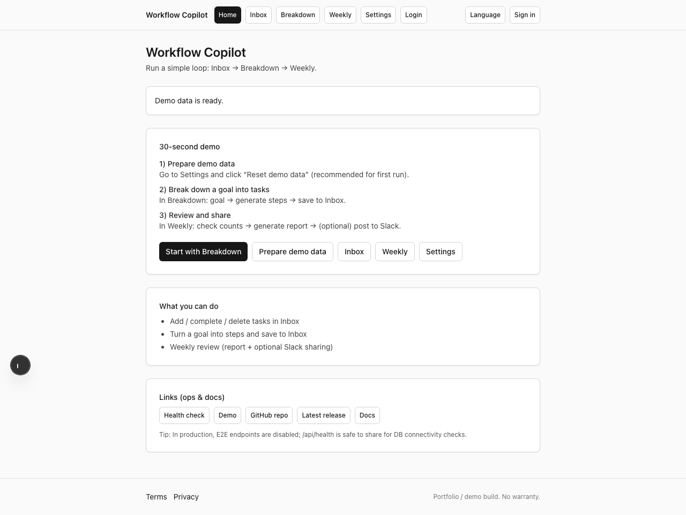
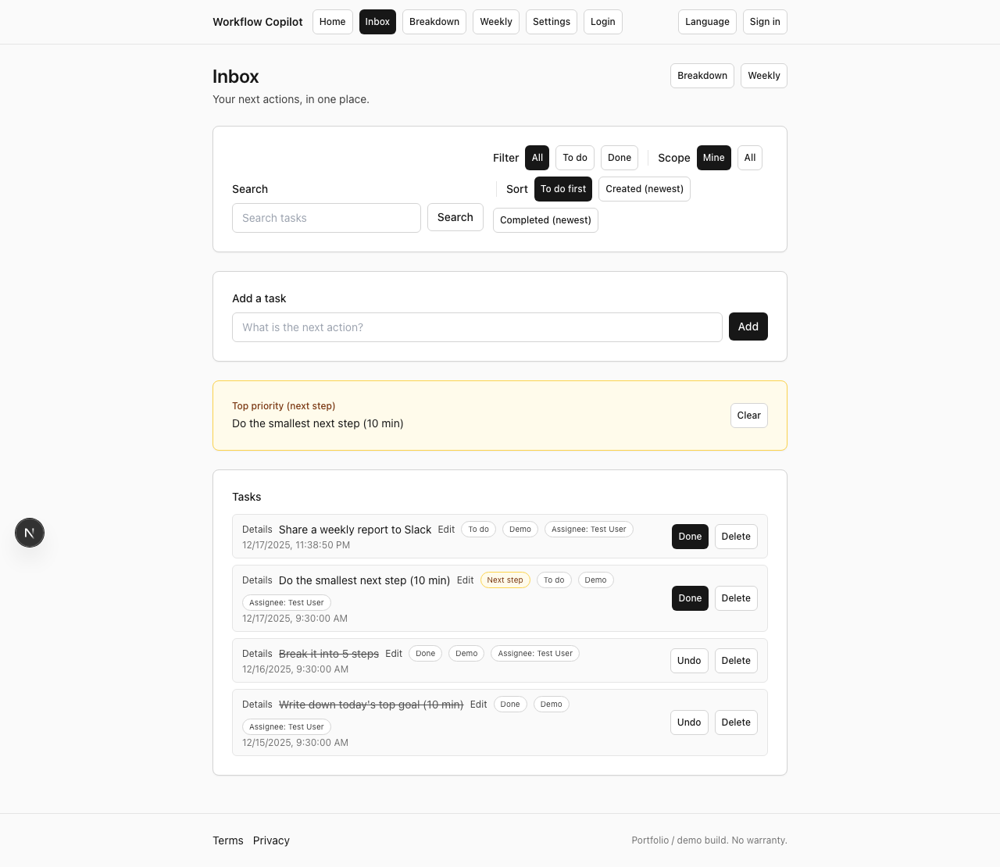
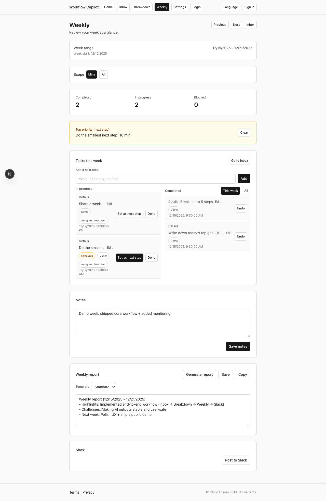

# Workflow Copilot AI

開発・業務で「次に何をやるか」を決めやすくする、個人〜小規模チーム向けの実行支援アプリです。  
**Inbox → Breakdown → Weekly → Next step（1つに絞る）** の流れを最短化し、任意でSlack共有できます。

## クイックリンク

- **デモ**: [workflow-copilot-ai.vercel.app](https://workflow-copilot-ai.vercel.app/)
- **リリース**: [v1.0.0](https://github.com/AyumuKobayashiproducts/workflow-copilot-ai/releases/tag/v1.0.0)
- **CI**: [Actions（ci.yml）](https://github.com/AyumuKobayashiproducts/workflow-copilot-ai/actions/workflows/ci.yml)
- **ヘルスチェック**: `GET /api/health` → [`/api/health`](https://workflow-copilot-ai.vercel.app/api/health)
- **日本語README（詳細）**: [`README.ja.md`](README.ja.md)
- **英語メモ（参考）**: [`README.en.md`](README.en.md)
- **ドキュメント一覧**: [`docs/INDEX.md`](docs/INDEX.md)

## 最初に見る場所（読む人別）

- **採用担当 / Findy**: `README.ja.md` → `docs/RECRUITER_NOTES.ja.md` → `docs/PUBLIC_RELEASE_CHECKLIST.ja.md`
- **開発者**: `docs/INDEX.md` → `docs/ARCHITECTURE.md` → `docs/RUNBOOK.md`
- **動作の証拠**:
  - CI: [Actions（ci.yml）](https://github.com/AyumuKobayashiproducts/workflow-copilot-ai/actions/workflows/ci.yml)
  - Health: [`/api/health`](https://workflow-copilot-ai.vercel.app/api/health)
  - E2E: `tests/e2e/`

## スクリーンショット（差し替え可）

> 更新したい場合: `npm run screenshots`（`docs/screenshots/` に出力）
